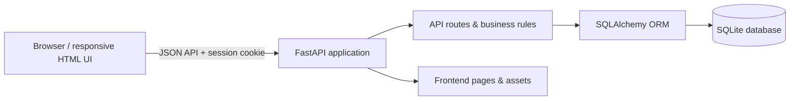
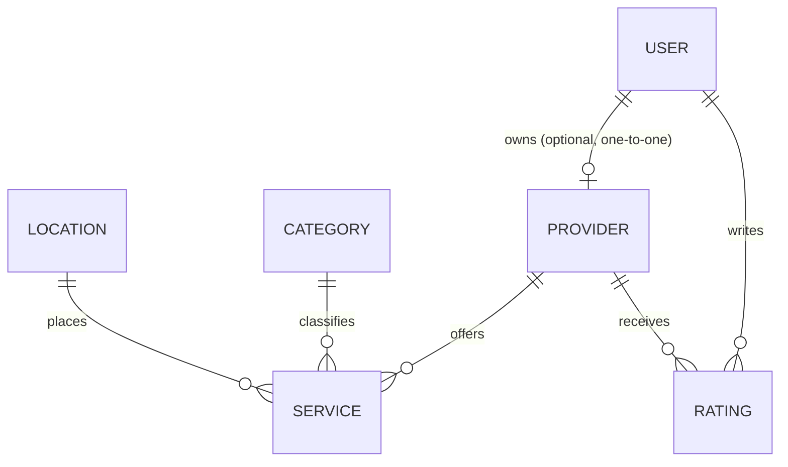

# Skill Link

> A full-stack local-services marketplace that helps people discover, compare, review, and connect with trusted service providers in their city.

Skill Link turns the often-frustrating search for reliable local help into a clear, searchable experience. Customers can explore services by category and location, view provider details and reviews, and leave ratings after signing in. Business owners can create and manage a single provider profile with multiple services, while administrators can review, verify, and manage listings.

## Why this project matters

Finding a trustworthy electrician, cleaner, caterer, repair specialist, or other local professional is still largely driven by word of mouth and scattered listings. Skill Link brings those decisions into one product experience:

- **For customers:** search local services, compare providers, inspect contact and location details, and share feedback.
- **For business owners:** establish a provider profile, list services, manage business information, and build trust through verification and reviews.
- **For administrators:** review listings, approve or revoke verification, search provider records, and process provider-claim requests.

## Highlights

- Secure account registration, login, logout, and cookie-based sessions.
- A protected **one-to-one user-to-provider relationship**: a user can own at most one provider profile, while imported listings can exist without a user account.
- Provider self-service dashboard for profile details, service listings, and provider deletion.
- Location-aware service discovery with category, keyword, and location filtering.
- Paginated provider and service listings.
- Provider detail pages with contact information, offered services, average ratings, and reviews.
- One rating per signed-in user per provider (subsequent ratings update the existing review).
- Admin dashboard for provider search, verification controls, pagination, and claim-request moderation.
- CSV-oriented provider import workflow, including metadata that distinguishes imported records from user-created profiles.
- SQLite schema upgrades run safely at application startup for existing local databases.
- Automated tests covering admin authorization, seed images, provider verification data, CSV import location assignment, and display-name normalization.

## Architecture



### Core data relationships



The `providers.user_id` field is unique. This protects the product rule that one authenticated user cannot create multiple provider businesses through the normal provider-registration flow.

## Tech stack

| Area | Technologies |
| --- | --- |
| Backend | Python, FastAPI, Uvicorn |
| Data access | SQLAlchemy ORM |
| Database | SQLite by default; configurable with `DATABASE_URL` |
| Frontend | HTML5, CSS3, JavaScript, Bootstrap, jQuery |
| Authentication | Password hashing with Python `scrypt`, opaque HTTP-only session cookies |
| Quality checks | Pytest |

## Product capabilities

| Capability | What it enables |
| --- | --- |
| Accounts & sessions | A customer can register, sign in, sign out, and access protected account actions. |
| Provider onboarding | A signed-in user can create one provider profile, add services, and supply location and contact details. |
| Provider discovery | Visitors can browse categories and search listings by text and location. |
| Reviews | Signed-in users can create or update ratings and optional comments for a provider. |
| Verification | Administrators can approve or revoke provider verification from the dashboard. |
| Listing claims | A business owner can request ownership of an imported listing for administrator review. |
| Data operations | Seed data and CSV import helpers support building out a local business directory. |

## Getting started

### Prerequisites

- Python **3.14+**
- `pip`

### 1. Clone and enter the project

```bash
git clone <your-repository-url>
cd citylisting-master
```

### 2. Create and activate a virtual environment

**Windows (PowerShell)**

```powershell
py -3.14 -m venv .venv
.\.venv\Scripts\Activate.ps1
```

**macOS / Linux**

```bash
python3 -m venv .venv
source .venv/bin/activate
```

### 3. Install dependencies

```bash
pip install -r requirements.txt
```

### 4. Run the application

**Windows:** double-click `start_backend.bat`, or run:

```powershell
.\.venv\Scripts\python.exe -m uvicorn backend.main:app --reload
```

**macOS / Linux:**

```bash
uvicorn backend.main:app --reload
```

Open [http://127.0.0.1:8000](http://127.0.0.1:8000) in your browser. The application serves the frontend and API from the same local server. FastAPI’s interactive API documentation is available at [http://127.0.0.1:8000/docs](http://127.0.0.1:8000/docs).

> The default database is created at `backend/db/citylisting.db`. To use another database supported by SQLAlchemy, set the `DATABASE_URL` environment variable before starting the application.

## Testing

From the repository root, with the virtual environment active:

```bash
pytest backend/tests
```

## API overview

The API is namespaced under `/api/v1`.

| Area | Example endpoints |
| --- | --- |
| Authentication | `POST /auth/register`, `POST /auth/login`, `POST /auth/logout`, `GET /auth/me` |
| Discovery | `GET /categories`, `GET /categories/services`, `GET /provider_services` |
| Provider management | `POST /providers`, `GET /providers/me`, `PUT /providers/me` |
| Provider services | `POST /providers/me/services`, `DELETE /providers/me/services/{service_id}` |
| Reviews | `POST /ratings`, `GET /ratings/{provider_id}` |
| Administration | `GET /admin/dashboard`, `GET /admin/providers`, provider verification endpoints |
| Ownership claims | provider claim status/request endpoints and admin claim-review endpoints |

See the live interactive contract at `/docs` while the development server is running.

## Project structure

```text
citylisting-master/
├── backend/
│   ├── db/                 # SQLAlchemy session, base, and schema upgrades
│   ├── middleware/         # Request timing middleware
│   ├── routes/             # Authentication, provider, admin, ratings, and discovery API routes
│   ├── seed/               # Seed data and CSV import utilities
│   ├── tests/              # Automated backend tests
│   ├── main.py             # FastAPI app, static serving, CORS configuration
│   ├── models.py           # Database models and relationships
│   ├── queries.py          # Listing and search queries
│   └── security.py         # Password and session-token utilities
├── frontend/               # Responsive pages, JavaScript, styles, and media assets
├── tools/                  # Local development helpers
├── IMPORT_WORKFLOW.md      # Provider import workflow notes
├── requirements.txt        # Pinned Python dependencies
└── start_backend.bat       # Windows development launcher
```

## Roadmap

- Complete import deduplication for external business data.
- Add richer provider claim and profile-update experiences.
- Surface more verification and trust signals in discovery results.
- Extend data-enrichment and maintenance tooling for imported listings.
- Add deployment configuration and production environment management.

## Author

ODUNSI OLATUNDE OLANREWAJU

---

If you are reviewing this project, start with the homepage, browse the directory, then explore the authenticated provider and administrative flows. Feedback and collaboration are welcome.
